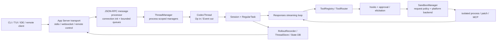
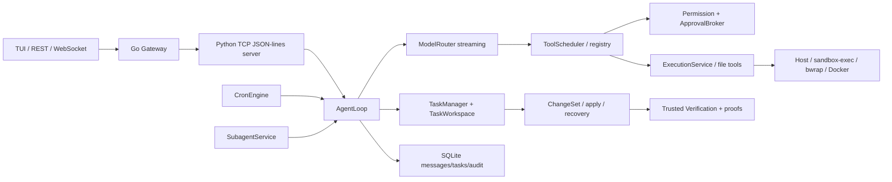

# Codex × Khaos 系统架构与安全差距报告

> Codex 基线：`3f74f00295dcb1346340686bb09c5bfd4f0237c4`
> Khaos 基线：`17f90ba0e63f7a43b7b062c9ae3e9b810b1f051d`
> 审查日期：2026-07-15
> 性质：首次交付，只读审查；不代表已完成安全修复

## 1. 审查结论

Khaos 不应改写成 Codex。Codex 更适合作为 Agent Harness、请求级 permission profile、跨平台 sandbox、turn/event、App Server 与交互测试的参考基线；Khaos 的 TaskManager、ApprovalBroker、ChangeSet、Trusted Verification、Approval Snapshot、CleanupProof、Verification Recovery、Scheduler、多 Agent 与 durable audit 应保留并提升为统一权威链。

固定 Khaos 提交的最高风险不是“缺少安全模块”，而是安全权威分散：`security.Sandbox` 以工具名表达能力，`PathGuard` 做预检查，`ExecutionService`/平台 backend 再做执行约束，Approval 和 Verification 又各自维护 binding/lease/store。默认 `AgentLoop` 在未注入 execution service 时构造 `HostExecutionBackend`；只读 backend selector 也可回退 Host。Host 子进程没有 OS 文件系统/网络隔离，`network_policy=none` 只是拒绝非 NONE 请求，不等于禁网。因此固定基线不能宣称 read-only、network denied 或宿主 secret isolation 已由 OS 强制。

Codex 的优势也不能绝对化：它存在显式 unsandboxed/full-access 路径；本地 stdio/loopback 的信任模型不等价于多租户 principal ownership；其 approval session cache 也不能替代 Khaos 的 Task/ChangeSet/Verification 证明。正确决策是采用边界形态，按 Khaos 身份和证明模型重写。

## 2. 进程、生命周期与数据流架构

### 2.1 Codex 固定基线

- Tokio 异步 runtime 承担网络、turn、tool futures、审批 oneshot、事件队列和子进程 I/O；阻塞工作通过专用 helper/process 边界处理。
- `ThreadManager` 是进程级装配根；`CodexThread` 是双向 conduit；`Session` 保存可变会话状态；每次输入创建 turn/task，工具结果继续进入同一采样循环。
- `RegularTask` 发出 `TurnStarted`，循环执行 `run_turn` 直至无 pending input，再发出唯一 terminal event；interrupt 使用 cancellation token 传播到采样和工具。
- rollout 先记录事件再供 thread store/state projection 重建；resume、fork、compaction 与 interrupted marker 有专门重建测试。

### 2.2 Khaos 固定基线

- Go Gateway 与 Python Agent 通过自定义 TCP JSON-lines 协议通信，接口名类似 RPC，但没有统一 schema/version envelope。
- `AgentLoop` 同时装配 task/workspace、model streaming、tool result、compression、verify-fix 和 persistence；模型 loop 与 durable task state 不是同一状态机。
- TaskManager/TaskWorkspace/ApprovalRuntime/Verification authority 提供了 Codex 没有的任务级证明和恢复能力，但调用链跨多个 store、hook、lease 与运行时 capability。
- Scheduler 与多 Agent 是产品级差异化能力；当前 MCP 只有文档性提及，没有生产 MCP client/server 生命周期实现。

## 3. 二十领域完整架构地图

| 领域 | Codex 实际实现 | Khaos 实际实现 | 证据入口 |
| --- | --- | --- | --- |
| 进程与线程模型 | Rust 单进程异步核心；App Server 多 transport；平台 sandbox/exec helper 和子进程；Windows/Linux 专用执行组件 | Go Gateway + Python JSON-lines Agent + 可选 Rust FFI + Docker/host/platform subprocess；多个进程边界无统一监督树 | Codex `app-server*`, `thread_manager.rs`, `exec-server`; Khaos `go/cmd/gateway`, `grpc_server.py`, `execution/` |
| Agent Loop | `RegularTask` + `run_turn`；stream item 驱动工具 future、pending input、auto compact、terminal flush | `AgentLoop.run` 内嵌 streaming、工具回送、一次空响应重试、compression、task hooks | `core/src/tasks/regular.rs`, `session/turn.rs`; `agent/core.py` |
| thread/turn/session | ThreadManager→CodexThread→Session→turn；start/resume/fork/steer/interrupt 有显式 ID 与事件 | session_id 主要绑定消息；coding task/workspace 是另一套生命周期；没有统一 turn id/state projection | `codex_thread.rs`, `thread_manager.rs`; `agent/core.py`, `task_manager.py` |
| 模型请求/流式事件 | Responses stream 转 `ResponseEvent`/`EventMsg`，事件顺序、tool pair、终态有大量测试 | provider stream 产生 `Message`；Gateway SSE/WS 再投影，协议字段较松散 | `session/turn.rs`; `routing/`, `go/internal/api` |
| 工具注册/调用 | typed tool spec + registry/router/runtime；pre/post hooks、exposure override、取消和输出截断 | Python registry + ToolScheduler；capability、permission、tool context 由字典和名称连接 | `tools/registry.rs`, `router.rs`; `tools/registry.py`, `tools/scheduler.py` |
| shell execution | argv/cwd/env/request policy 进入 exec runtime；审批判定与 OS sandbox 分离；process tree/输出有专用组件 | ExecutionRequest 已含 cwd/env/network/budget；但 Host 是固定基线默认/只读 fallback，foreground terminate registry 不完整 | `tools/runtimes/shell.rs`, `exec-server`; `execution/service.py`, `host.py` |
| 文件系统访问 | permission profile + protected metadata + patch layer；平台 sandbox 是最终边界 | file tools + PathGuard + Python resolve；workspace apply/recovery；缺 dirfd/openat2 等 race-safe 统一层 | `protocol/permissions.rs`, `apply-patch`; `file_tools.py`, `workspace/` |
| Sandbox | ReadOnly/WorkspaceWrite/FullAccess/External 与 network policy；Seatbelt、Landlock/bwrap/seccomp、Windows restricted token/WFP | 工具名 Sandbox + platform wrappers + Docker；模式概念和执行 profile 没有统一不可变对象 | `protocol.rs`, `sandboxing/`; `security/sandbox.py`, `execution/platform.py` |
| Approval | policy、hook、Guardian/User reviewer、oneshot pending、shell/patch/MCP elicitation | Permission engine、通用 broker、operation approval、plan approval、durable receipt 多层并存 | `tools/approvals.rs`; `agent/approval.py`, `planning/approval/` |
| 权限升级 | 首次 sandbox 尝试、NeedsApproval/Forbidden、additional permissions；拒读约束不允许被简单 bypass | tool_call/ChangeSet/plan binding 有 digest/expiry/receipt；尚未统一 principal/session/task/tool/args/workspace/nonce | `tools/sandboxing.rs`; `approval/*`, `verification_authority.py` |
| 网络策略 | request profile；Seatbelt/namespace/WFP；可配置 restricted/enabled 和 proxy | enum 有 none/loopback/unrestricted-with-approval；Docker/bwrap/Seatbelt部分强制，Host 的 NONE 不强制禁网 | `permissions.rs`, platform sandbox; `execution/models.py`, backends |
| App Server/Gateway/RPC | versioned JSON-RPC types、initialize capabilities、bounded queues、WS auth/JWT/capability token、remote auth | REST/SSE/WS + 自定义 TCP JSON-lines；API key 主要在 Gateway；Python TCP 缺 principal/auth/version/size envelope | `app-server-protocol`, `app-server-transport`; Go `api`, `platform/python_client.go`, `grpc_server.py` |
| TUI | 直接消费结构化 events；approval UX、snapshot/golden tests、resume/history | Textual TUI 直接迭代 AgentLoop；permission dialog 与 git diff preview；部分 UI 直接调用 host `git diff` | `tui/`; `tui/app.py`, `permission_dialog.py` |
| 配置加载 | layered config、profile/constraints、typed schema、managed requirements、兼容性处理 | project `config.yaml` 后由 `~/.khaos/config.yaml` 覆盖；YAML+env 展开，类型/安全约束较弱；写配置非 atomic | `core/config`, `config`; `config.py` |
| MCP | connection manager、server lifecycle、tool discovery、elicitation/approval、OAuth/reauth、动态工具 | 无生产实现；只有文档提及 | `session/mcp.rs`, `rmcp-client`; Khaos source search |
| context compaction | incremental history、local/remote compact、window ID、重建、tool pair 与初始 context reinjection | threshold + compressor；和 Task/Plan/Approval/Verification durable facts 没有统一保留协议 | `compact.rs`, reconstruction tests; `agent/compressor.py` |
| 恢复与持久化 | JSONL rollout + ThreadStore + state DB projection；resume/fork/rollback/partial history | SQLite messages/tasks/audit + TaskWorkspace recovery + verification stores；跨 store 原子性复杂 | `rollout`, `thread-store`, `state`; `db`, `task_manager`, `workspace/recovery.py` |
| 任务调度 | OSS core 没有 Khaos 等价 durable cron domain；产品层存在客户端自动化概念，不作为本审查代码结论 | CronEngine、scheduled_tasks、cron tools | Khaos `scheduler/`, `tools/cron_tools.py` |
| 审计日志 | tracing、rollout event log、state DB audit helper；不是 Khaos 式统一 durable action ledger | `audit_log`、结构化 AuditLogger/export/query；写路径是否全覆盖仍需证明 | Codex rollout/tracing/state; Khaos `audit/`, `db/schema.sql` |
| 测试和 CI | crate 单元/集成、app-server protocol tests、TUI snapshots、三平台 sandbox、fmt/clippy/deny/lockfile | 181 个 Python test files、3 个 Go test files、23 个 Rust `#[test]`；Linux/macOS sandbox 和 Docker E2E；缺统一全栈协议/security gate | 两边 `.github/workflows`, tests |

## 4. 差距矩阵

| 领域 | Codex 实现 | Khaos 实现 | Codex 优势 | Khaos 优势 | 风险 | 决策 |
| --- | --- | --- | --- | --- | --- | --- |
| 进程监督 | async core + helper/process boundary | Go/Python/Rust/Docker 混合 | 取消/transport/exec 分层更清晰 | 可独立扩展 Gateway 与性能层 | 子进程或跨进程取消丢失 | `ADAPT`：统一 execution/session supervisor |
| Agent Loop | 单一 turn task 与 terminal event | loop、task、workspace 状态并列 | 工具继续与事件顺序成熟 | Task/Verification 语义更强 | 多个终态互相矛盾 | `ADAPT`：用 Khaos domain 扩展 Codex 型 turn machine |
| 生命周期 | thread/session/turn ID 显式 | session/task/workspace ID 分散 | resume/fork/steer 前置条件 | 长任务和 workspace 生命周期 | 跨对象 ownership 不明确 | `ADAPT` |
| streaming | typed events + projection | Message dict + SSE/WS | schema/golden/replay | 简洁、provider 多样 | 客户端解释漂移、事件丢失 | `ADOPT` typed event envelope，按 Khaos 重写 |
| 工具系统 | registry/router/runtime/hooks | registry/scheduler/context dict | 调用边界和取消清晰 | 工具覆盖更广、Task 感知 | 绕过 scheduler 可绕过政策 | `ADAPT` 成唯一 dispatcher |
| shell | OS sandbox request pipeline | Host/platform/Docker | policy 与 classifier 分离 | 已有 budget/task workspace | Host fail-open、NONE 假禁网 | `ADOPT` 请求级选择原则；删除静默 fallback |
| 文件系统 | protected metadata + sandbox | resolve/guard/file tools | `.git/.agents/.codex` 显式保护 | ChangeSet/recovery | TOCTOU、hardlink、配置目录写 | `ADAPT` dirfd/openat2 等安全 API |
| Sandbox | 三平台强制后端 | capability 名单 + 部分后端 | OS 强制和负向测试 | Docker与工作树语义 | 工具分类被误当边界 | `ADOPT` policy model，`REJECT` 名称名单作为强边界 |
| Approval | policy+reviewer+elicitation | 多级 broker/receipt/lease | 工具执行编排成熟 | ChangeSet/plan durable binding | principal/session binding 不完整 | `ADAPT`，保留 Khaos 证明 |
| 权限升级 | structured additional permissions | approval_key/digest/expiry | 最小权限 profile 可组合 | boot/receipt/one-shot 设计更强 | replay/cross-scope 混淆 | `ADAPT` 统一 capability token |
| 网络 | OS/profile enforcement | enum + backend-specific | 平台覆盖更完整 | 可表达 loopback | Host 无法强制、DNS/UDS 泄漏 | `ADOPT` deny-by-default，平台实现重写 |
| RPC | versioned JSON-RPC + init/backpressure/auth | ad-hoc REST/WS/JSONL | schema、能力协商、有界队列 | Gateway/渠道/任务 API 现成 | Python TCP 裸露、无 ownership/replay | `ADAPT`，不复制协议品牌 |
| TUI | event-native + snapshots | product-specific Textual UI | turn/approval UX 一致 | 双模式与 Task UX | UI 旁路 host 命令 | `ADAPT` event model，`RETAIN` Khaos 表现 |
| 配置 | typed layered constraints | YAML merge/env | validation/managed policy | 简单、易部署 | 未知安全值 fallback、非 atomic 写 | `ADAPT` typed/versioned config |
| MCP | 完整 manager/elicitation | 无生产实现 | 生命周期/side-effect policy | 无兼容包袱 | 直接接入会形成新旁路 | `DEFER` 到统一 dispatcher/RPC 后 |
| Compaction | windowed/reconstructable | message summary | 历史不变量测试强 | 可注入 Task/Plan | 证明/审批事实可能被摘要丢失 | `ADAPT`，Task facts 不进入自由摘要 |
| 恢复 | rollout event sourcing | 多 store domain recovery | replay/partial-tail 成熟 | Verification Recovery/CleanupProof | 跨 store 非原子、重启歧义 | `ADAPT` event ledger；`RETAIN` Khaos proof |
| Scheduler | 无等价核心 | durable CronEngine | — | 明确差异化能力 | 调度主体/权限快照过期 | `RETAIN`，接入统一 principal/profile |
| 多 Agent | agent control/graph/jobs | 单层 SubAgent/Planner/Service | graph/control 基础 | 产品约束与 Task 集成 | 子代理权限继承不清 | `RETAIN`，`ADAPT` capability delegation |
| durable audit | rollout/tracing/state | audit_log/export | 事件粒度和重放 | 行为审计域明确 | 并非所有写入统一记录 | `RETAIN`，补 append-only hash chain/coverage |
| 测试/CI | 多平台、schema/snapshot/deny | 大量 domain tests + 两个 sandbox workflow | 真实平台与协议门禁 | Verification 负向矩阵深 | mock 通过被误报真实安全 | `ADOPT` 测试分类和 gate 纪律 |

## 5. 安全边界对比

### 5.1 Sandbox 与 Approval

Codex 将 read-only、workspace-write、full access/external sandbox 和 network policy 放入每次 turn/tool 的结构化权限 profile；工具安全分类只决定“是否应询问/可否跳过首次 sandbox”，不承担内核强制。macOS Seatbelt、Linux namespace/Landlock/seccomp、Windows restricted token/ACL/WFP 承担最终边界；`.git`、`.agents`、`.codex` 等 metadata 默认保护。

Khaos 固定基线的 `security.Sandbox` 通过 tool name allowlist 表达 read-only；`test_run` 被标为“只读”，但测试命令本身可以写缓存、构建产物或任意可写宿主路径。`PathGuard.resolve()` 是使用路径前的时点检查，不能阻止检查后 symlink/rename 替换。`AgentLoop` 的 Host 默认和 selector 的只读 Host fallback 使 read-only/network none 不能视为强隔离。结论：策略意图存在，OS 强制只在选中并成功运行的 Docker/bwrap/Seatbelt 路径成立。

决策：命令分类保留为风险/UX signal；所有执行和文件写统一消费不可变 `PermissionProfile`。backend 不可用、probe 失败、配置无效一律拒绝，不能转 Host。full access 必须显式、短时、可审计，不能由未知模式 fallback 得到。

### 5.2 Execution backend

| 检查项 | Codex | Khaos 固定基线 | 结论 |
| --- | --- | --- | --- |
| 请求级选择 | command/cwd/policy/network 每次进入 SandboxManager | backend 在 service 构造时为主，hint 只特殊选 Docker | Khaos 改为请求级、不可变 profile |
| Host fallback | 有明确 unsandboxed/full access 分支，受 policy/approval 控制 | AgentLoop 默认 Host；只读 selector 回退 Host | 删除静默 fallback |
| probe 失败 | transform/helper 缺失返回错误；平台支持逻辑独立 | writable 部分 fail closed；macOS 仅 `which`，read-only 仍 Host | 所有受限 profile 都 fail closed |
| cwd/workspace | turn config + sandbox cwd/writable roots | workspace-write 校验 TaskWorkspace；read-only 不要求 workspace | 所有 profile 绑定 canonical workspace |
| 环境变量 | env policy/exec server 过滤 | allowlist 有效，但同进程已持有 secret，Host 可读其他宿主资源 | runner 进程启动前构造最小 env，secret broker 隔离 |
| 取消/进程树 | cancellation token + process helper/platform tree kill | managed process group 较好；foreground registry/terminate no-op | 统一 supervisor，TERM→grace→KILL |
| 资源配额 | timeout/output及平台机制 | Docker 执行 pids/cpu/memory/tmpfs；Host 多数只执行 timeout/output | restricted profile 必须强制或拒绝 |
| 输出截断 | token/byte 工具输出策略 | bytes slice；stdout 优先可能饿死 stderr；Host 各自上限可翻倍 | 统一流式有界 ring buffer/artifact policy |
| 网络隔离 | profile + OS/proxy | Docker/bwrap/Seatbelt；Host NONE 无隔离 | NONE 必须有真实证明 |

### 5.3 Agent Loop

Codex 的 turn 有开始、进行中、完成/中断/失败投影，审批等待与工具 future 受 cancellation token 控制；中途输入、auto compaction、重试错误和 rollout flush 都在同一生命周期中。Khaos 的 `Message.stop_reason`、TaskStatus、WorkspaceState、verify-fix status 和 Gateway event 各自表达终态，缺少“一个 turn 只能提交一个 durable terminal transition”的中心不变量。

必须建立：`TurnStarted(seq)` → 零或多个 model/tool/approval events → 恰好一个 `TurnCompleted|TurnInterrupted|TurnFailed`；terminal 之前先 durable flush；重放只接受单调 sequence；工具调用必须存在唯一 call/result 或明确 cancelled；approval wait 可取消且取消后迟到决定无效；retry 创建 attempt，不创建第二终态。

### 5.4 App Server 与 RPC

Codex App Server 使用 typed JSON-RPC、initialize client info/capabilities、bounded channel（基础容量 128）、慢连接拒绝/断开、turn id 前置条件、interrupt 与 thread history projection。WebSocket 可配置 capability token 或签名 bearer token，remote control 绑定 ChatGPT account；本地 transport 仍依赖本机信任边界，不应推导成普适多租户 ownership。

Khaos Gateway 对外有 API key/rate limit/request body 局部限制，但 Gateway→Python 使用裸 TCP JSON-lines、每次新连接、无 protocol version、principal、session ownership、request id、统一错误、frame 上限或事件 replay cursor。WS hub 的 session id 来自路由，广播写失败被忽略，慢客户端可阻塞广播循环。取消主要关闭客户端读取，不保证传播到 Python turn/工具进程。

新协议必须包含 `protocol_version, request_id, connection_id, principal, session_id, task_id, turn_id, method, payload, idempotency_key`；服务端验证 principal ownership；审批和取消不得只凭公开 ID；设置最大 frame/depth/string/tool-output；有界 per-connection queue；使用 sequence/cursor 支持重放；错误分为 invalid/auth/forbidden/conflict/unavailable/timeout/internal。

### 5.5 文件系统

Codex 的 protected metadata 和 permission matcher 提供较好的 policy 层，OS sandbox 提供执行边界；仍不能把普通 canonicalize 当成跨所有平台的无竞态写原语。Khaos file tools、config writer、workspace apply 多用 `Path.resolve` 后再 open/write/rename，缺统一 dir handle、no-follow、inode/device 验证和 hardlink policy。

Batch E 的安全 API 必须：

- 从预先打开的 workspace dirfd 解析相对路径；Linux 优先 `openat2(RESOLVE_BENEATH|NO_MAGICLINKS|NO_XDEV)`，其他平台使用逐段 `openat`/`O_NOFOLLOW` 等价实现；
- 拒绝绝对路径、`..`、空/NUL、保留 metadata，默认拒绝跨设备；
- 写前后核验 inode/device/link count；敏感写拒绝 hardlink，读取只接受 canonical trusted handle；
- 临时文件在目标目录同设备创建，`fsync(file)`、原子 rename、`fsync(dir)`；
- patch 先形成 ChangeSet，校验 base digest，再一次性应用或回滚；
- sandbox 中 workspace 之外只读或不可见，宿主 HOME、SSH agent、cloud credentials、Docker socket、代理变量不可见。

## 6. 决策清单

### ADOPT（采用设计，不等于复制代码）

- 请求级、结构化 sandbox/permission profile。
- 风险分类与 OS 强制边界分离。
- backend unavailable/probe failure fail closed。
- typed turn events、唯一终态、sequence/cursor 和 terminal-before-observe 持久化。
- App Server initialize/capabilities、bounded queue、明确错误分类。
- protected agent metadata 与平台真实 sandbox 测试纪律。

### ADAPT

- Agent loop、approval orchestration、App Server、compaction、rollout reconstruction、process supervision。
- Codex 的 approval 需增加 Khaos principal/session/task/ChangeSet/Verification binding。
- Codex thread model 需容纳 Khaos durable Task/Workspace/Plan，而不是取代它们。
- 多 Agent capability delegation 和 Scheduler execution snapshot。

### RETAIN

- TaskManager、ApprovalBroker、ChangeSet、Trusted Verification。
- Approval Snapshot、CleanupProof、Verification Recovery。
- Scheduler、单层多 Agent、durable audit。
- Khaos 双模式、产品品牌和现有 API 的兼容入口（内部可适配新协议）。

### REJECT

- 把 Khaos 改写或品牌化为 Codex。
- 以命令名/字符串分类证明 read-only 或 network denial。
- 受限 backend 失败后 Host fail-open。
- 仅靠 SQLite trigger 建立连接权限。
- 把同进程 private attribute/token/secret 当作强隔离。
- 同时长期保留旧、新两套等价执行或 RPC 权威。
- 无来源复制、大模块整块搬运、删除上游声明。

### DEFER

- 在统一 tool dispatcher、RPC 和 permission profile 之前接入 MCP。
- 直接复制 `apply-patch` 或整套 Rust app-server。
- 与首批安全边界无关的 UI 品牌/动画对齐。
- 浮动跟踪 Codex main 或自动同步上游实现。

## 7. 最高优先级十项

1. 删除 AgentLoop 和受限模式的 Host 默认/fallback；backend 不可用即拒绝。
2. 建立唯一 `PermissionProfile`，由 turn、工具、执行、MCP、Scheduler、SubAgent 同时消费。
3. 统一 turn event/state machine，确保取消、审批等待和 terminal durability。
4. 将 approval 绑定 principal/session/task/tool call/args digest/workspace/expiry/one-shot nonce。
5. 用 authenticated、versioned、本地优先的 RPC 替代裸 Python TCP JSON-lines。
6. 建立真实 read-only/workspace-write/network denial/secret isolation 平台 E2E gate。
7. 建立 dirfd/openat2 等价文件 API，修复 symlink/hardlink/rename TOCTOU。
8. 将 foreground、managed、Docker 进程统一纳入 supervisor 和资源/输出配额。
9. 把 Trusted Verification 的 trusted read、write authority、cross-boot ledger 收敛为独立安全进程/最小能力服务。
10. 建立 append-only、sequence 化事件账本，协调 Task/Workspace/Approval/Verification/Audit 的 crash recovery。

## 8. 未解决问题与审计盲区

- 未在本次运行中编译和执行 Codex 三平台测试；Codex 结论来自固定源码、测试和 CI 定义的静态审查。
- 未在真实 Windows、Linux、Docker daemon 和生产 macOS 权限环境运行 Khaos E2E。
- 未验证 Khaos 部署是否把 Python TCP 端口暴露到 loopback 之外，也未获得容器/Kubernetes/systemd 配置。
- 未完成每个写工具到 `audit_log` 的全路径动态覆盖证明。
- 未证明 Approval/Verification 多个 SQLite store 在断电、WAL 损坏、跨 boot 时的原子性。
- hardlink、rename exchange、mount replacement、network DNS/UDS/proxy 旁路尚无完整真实测试。
- 同进程 Python capability/私有字段能防误用，不能防同进程恶意代码；强隔离边界仍需进程/OS。
- Codex 的远程服务端、Guardian 后端和闭源客户端行为不在 OSS 审查范围。
- Khaos 当前未提交 Phase 0 overlay 可能已处理部分问题，但未绑定固定提交，不计为关闭项。
